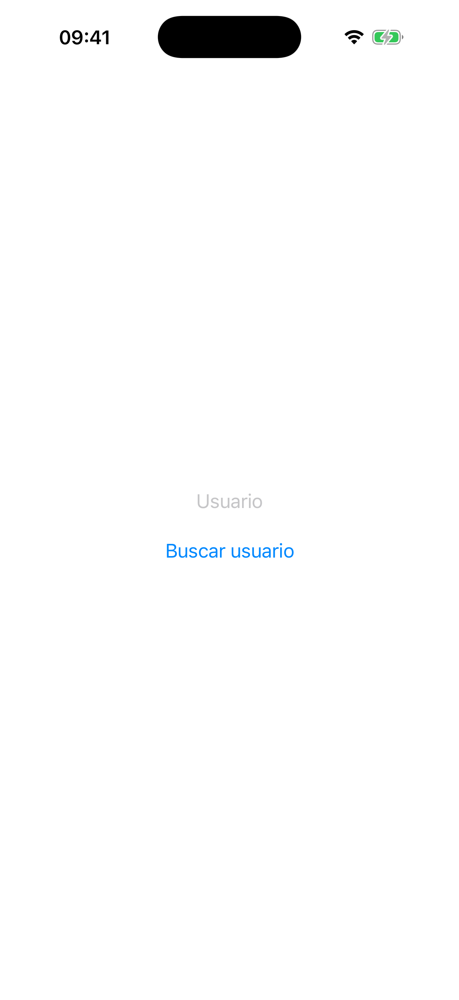
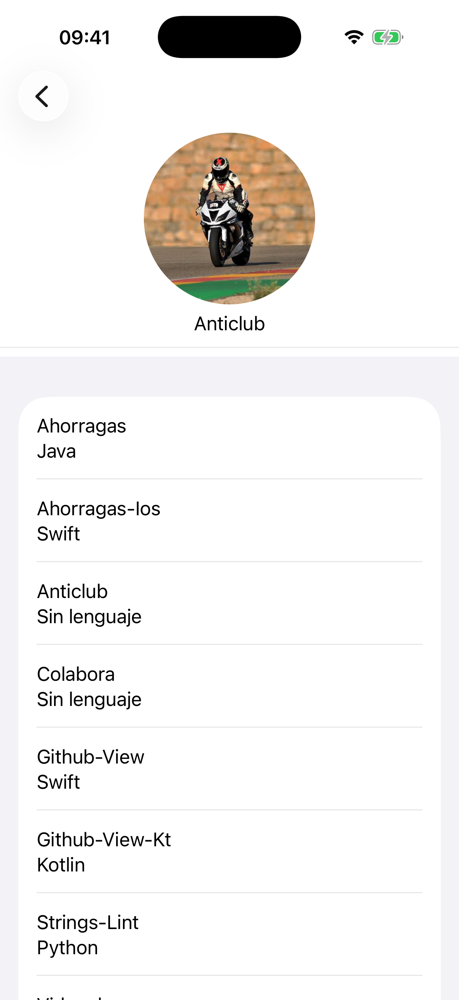
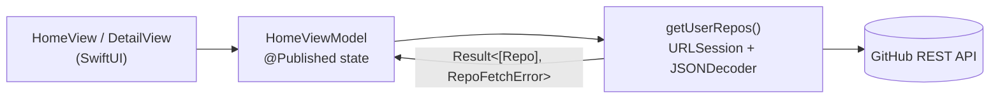

# GitHub Viewer (iOS)


> **EN:** iOS app (SwiftUI) that queries the public GitHub API: type a username and see their repositories with the primary language of each one.
> **ES:** App iOS (SwiftUI) que consume la API pública de GitHub: escribe un usuario y consulta sus repositorios con el lenguaje principal de cada uno.

📱 **Also available for Android / También disponible para Android** → [GitHub-View-Kt (Kotlin)](https://github.com/Anticlub/GitHub-View-Kt).
Same app, two native ecosystems / Misma app, dos ecosistemas nativos.

---

## 📸 Capturas / Screenshots

<p align="center">
  
  &nbsp;&nbsp;
  
</p>

---

## 📚 Overview / Descripción general

**EN:** The user types a GitHub username; the app calls `GET /users/{user}/repos`, decodes the response and navigates to a detail screen showing the user's avatar and the list of repositories with their language. Loading state and error messages (user not found, no network, bad status…) are handled explicitly and localized.

**ES:** El usuario escribe un nombre de GitHub; la app llama a `GET /users/{user}/repos`, decodifica la respuesta y navega a una pantalla de detalle con el avatar del usuario y la lista de repositorios con su lenguaje. El estado de carga y los mensajes de error (usuario no encontrado, sin red, código de estado incorrecto…) se gestionan de forma explícita y localizada.

---

## ✨ Features / Características

- 🔎 **EN:** Search a user's public repositories. **ES:** Búsqueda de repositorios públicos de un usuario.
- 🗂️ **EN:** Repo list with primary language. **ES:** Listado de repos con su lenguaje principal.
- 🖼️ **EN:** User avatar via `AsyncImage`. **ES:** Avatar del usuario con `AsyncImage`.
- ⏳ **EN:** Explicit loading state. **ES:** Estado de carga explícito.
- ⚠️ **EN:** Typed, localized error handling. **ES:** Manejo de errores tipado y localizado.
- 🌍 **EN:** English & Spanish localization. **ES:** Localización en inglés y español.

---

## 🏗️ Architecture / Arquitectura

**EN:** MVVM with a clear separation between view, view model and networking layer. Errors are modeled with a dedicated `enum` (`RepoFetchError`) instead of loose strings.

**ES:** MVVM con separación clara entre vista, view model y capa de red. Los errores se modelan con un `enum` propio (`RepoFetchError`) en lugar de cadenas sueltas.



- **View** — `HomeView` (search) and `DetailView` (avatar + repo list).
- **ViewModel** — `HomeViewModel` (`@MainActor`, `@Published` state, maps errors to localized messages).
- **Networking** — `getUserRepos` (`URLSession`) + `parseUserReposJSON` (`JSONDecoder`), returning `Result<[Repo], RepoFetchError>`.
- **Model** — `Repo` / `Owner` (`Decodable`).

---

## 🛠️ Tech stack

Swift · SwiftUI · MVVM · URLSession · Codable/JSONDecoder · `NSLocalizedString` (en/es) · XCTest (unit + UI tests)

---

## 🚀 Requirements & run / Requisitos y ejecución

**EN:** Requires Xcode (iOS 18+). Clone the repo, open `GitHub Viewer.xcodeproj` and run on a simulator or device.
**ES:** Requiere Xcode (iOS 18+). Clona el repo, abre `GitHub Viewer.xcodeproj` y ejecuta en simulador o dispositivo.

```bash
git clone https://github.com/Anticlub/GitHub-View.git
```

> **EN:** The public GitHub API is rate-limited for unauthenticated requests (~60/hour per IP).
> **ES:** La API pública de GitHub limita las peticiones sin autenticar (~60/hora por IP).
